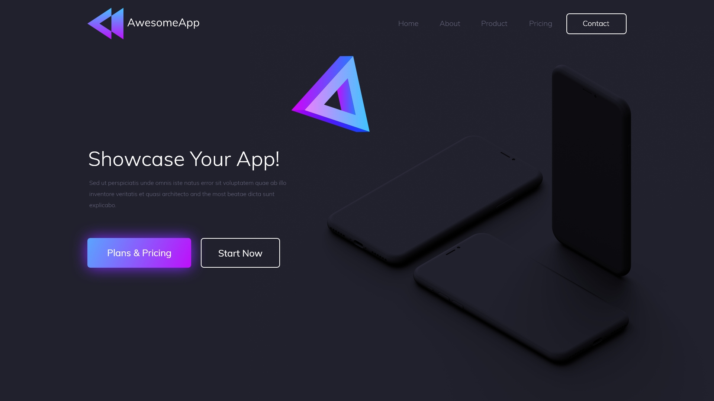

# Day 1 - Getting Started

Bismillah.

Tujuan utama dari High Selling Web Design Bootcamp adalah untuk membentuk sinergi yang kuat antara Web Designer dan Web Developer.

Kunci sinergi antara Web Designer dan Web Developer adalah kesesuaian antara spesifikasi desain dan implementasinya pada sebuah halaman website.

Di pertemuan pertama ini, kita akan memulai dengan bagaimana proses desain sebuah website untuk memahami dengan baik spesifikasi desainnya.

## A. Apa saja yang perlu dipersiapkan?

Tool desain yang akan kita gunakan adalah Figma.

Kenapa Figma?

- Bisa digunakan oleh semua dekstop platform karena aplikasinya berbasis web
- Bisa kolaborasi dengan 2 orang atau lebih
- Lebih ringan dan stabil dibandingkan dengan software native seperti Adobe XD atau Sketch

Download aplikasinya disini:

?>
	- Mac: https://www.figma.com/download/desktop/mac/  
	- Windows: https://www.figma.com/download/desktop/win/  
	- Linux: https://www.figma.com/ (Web Version)

## B. Mengenal istilah di Figma

Sebelum men-desain, ada beberapa istilah yang perlu kita ketahui:

- **Frame**  
Adalah *canvas* yang digunakan untuk semua komponen desain. Ukurannya biasanya sesuai screen device yang akan didesain, misalnya untuk mobile atau desktop.  

- **Layout Grid**  
Untuk memudahkan desain, kita menggunakan grid sistem. Yaitu membagi *Frame* dengan beberapa kolom. Fungsi kolom adalah menjadi acuan besarnya elemen desain yang akan kita buat. Umumnya desain web menggunakan 12 kolom, dengan lebar kolomnya (*Width*) 70px, dan jarak antar kolomnya (disebut dengan *Gutter*) 30px.

- **Layers**  
Semua elemen desain yang kita buat akan ditampilkan dalam bentuk layer.

## C. Shortcut yang sering digunakan

- Zoom in/out dengan tekan `Ctrl + Mouse scroll` depan belakang
- Geser editor dengan tekan `Space + Klik kiri` drag ke arah yang diinginkan
- Hide semua UI editor dengan tekan `Ctrl + \`
- Memindahkan elemen desain setiap 10 pixel `Shift + Arrow`
- Duplicate desain dengan `Ctrl + D`
- Duplicate dengan drag `Alt + Klik kiri` drag ke arah yang diinginkan. Tekan `Shift + Alt + Klik kiri` agar perpindahannya lurus.
-  Align to left `Alt + A`
-  Align horizontal center `Alt + H`
-  Align to right `Alt + D`
-  Align to top `Alt + W`
-  Align vertical center `Alt + V`
-  Align to bottom `Alt + S`

## D. Desain landing page

Kita akan memulai dengan men-desain bagian pertama sebuah landing page berikut ini:

Buka Figma, dibawah ini akan disebutkan langkah-langkah cara membuatnya.

### 1). Persiapan

#### Frame dan Layout Grid

1. Klik , yang ada disebelah pojok kanan atas.  
Figma akan membuka file baru dengan nama *Untitled*.

	

2. Beri nama file dengan mengubah *Untitled*, misalnya menjadi "Awesome App".  
Klik *Untitled* yang ada dibagian tengah di toolbar atas menjadi *Awesome App* kemudian tekan Enter.

	

3. Buat *Frame*. Caranya klik  yang ada dibagian atas sebelah kiri atau dengan menekan `F` pada keyboard.  
Kemudian arahkan kursor ke area kosong dan klik kiri 1x sampai keluar frame kosong dengan ukuran 100 x 100 px.

	

4. Pada panel sebelah kanan, ubah ukuran frame menjadi 1920 x 1080 px (Width x Height).

	

5. Mengatur *Layout Grid*.  
Untuk mengaturnya, scroll kebawah pada panel sebelah kanan, selanjutnya:
	- Klik  pada menu *Layout Grid*, untuk membuat grid baru.  

	

	- Ubah bentuk *Grid* menjadi *Columns*, dengan Klik  dan ubah *Grid* menjadi *Columns*.

	

	- Selanjutnya, ubah optionnya menjadi seperti ini:   
		*Count* = **12**  
		*Type* = **Center**  
		*Width* = **70**
		*Gutter* = **30**

	

#### Download bahan desain

!> Download semua bahan desainnya disini:  
https://drive.google.com/open?id=1DXDULcAueUk4zj8Z6rUvJAkSVKd3RW0f.

Apa saja yang tersedia di bahan desain?

?>
	- Logo Awesome App  
	- Mascot  
	- Colors  
	- Gambar phone mockup  
	- Gambar preview landing page

#### Import bahan desain

1. Import semua bahan desain dengan drag ke Editor Figma.

	

	Keluarkan semua bahan desain dari *Frame* dan rapikan secukupnya agar memudahkan proses men-desain.

	

2. Ubah warna *Frame* utama dengan mengambil warna dari gambar Landing page.  
	
	

	Ikuti langkah-langkah berikut:
	- Klik pada *Frame* terlebih dahulu,  
	- Kemudian scroll kebawah pada panel sebelah kanan, sampai terlihat opsi *Fill*  
	- Klik pada kotak warna, ambil warna background dari gambar preview landing page dengan klik icon   
	- Selanjutnya klik pada gambar preview
	- Sekarang warna *Frame* sesuai dengan gambar preview.

### 2). Menyesuaikan logo

1. Ubah warna text AwesomeApp menjadi putih pada logo.
	
	

2. Pindahkan logo ke *Frame* utama. Tempatkan pada grid kolom paling kiri, sampai garis merah tanda sejajar dengan kolom muncul.

	

3. Sambil tekan `Shift` pada keyboard, klik dan tahan pada bagian pojok kanan bawah logo, kemudian sesuaikan lebar logo dengan 3 kolom.  
Lepas klik sampai garis merah muncul di batas kanan pada kolom ke 3.

	

4. Buat logo align to top dengan *Frame*, dengan klik pada logo kemudian tekan `Alt + W` pada keyboard.
	
	

5. Tambahkan jarak 40 px dari top *Frame*, dengan klik pada logo lagi, kemudian tekan `Shift + Arrow Down` 4 kali (ingat, 1 kali = 10 px).

	

### 3). Membuat menu navigasi

Untuk membuat menu, kita akan menuliskannya secara manual dengan menggunakan menu Text.

1. Klik  di toolbar bagian atas sebelah kiri atau tekan `T` pada keyboard.

	

2. Buat text menu sesuai gambar preview landing page.  
	- Atur ukuran font nya menjadi 20 px  
	
	

	- Ubah warnanya menjadi putih atau #fff  

	

	- Sesuaikan urutan dan jarak antar menu

	

### 4). Membuat button menu

Untuk membuat button dengan size yang dinamis, kita akan membuatnya menggunakan *Frame*.
	
1. Tekan `F` untuk membuat frame, sesuaikan ukurannya menjadi 160 x 50 px.

	

2. Hilangkan button background dengan hide *Fill*, kemudian tambahkan *Stroke* dengan ukuran 2 px berwarna #fff (putih). Kemudian ubah *Corner Radius* menjadi 7 px. 

	

3. Duplicate text menu dan masukkan text nya kedalam button.

	

