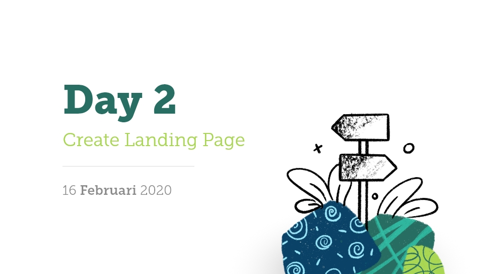

# Day 2 - Create Landing Page

## A. Apa saja yang perlu diperhatikan?

Untuk men-desain halaman website termasuk sebuah Landing Page harus memperhatikan konsistensi. Konsistensi ini setidaknya terbagi menjadi 3:

1). Spacing  
2). Contrast  
3). Grid System  
3). Komposisi Layout

### 1). Spacing

*Spacing* adalah istilah yang digunakan untuk standar pengaturan jarak antar elemen desain, vertikal atau horizontal.

Sebelum kita menentukan jarak, kita perlu mengetahui ukuran awalnya, yang disebut dengan *Spacer*.

Umumnya *Spacer* menggunakan ukuran `16px`.

Berikut adalah ukuran standar yang sering digunakan dalam desain web, dengan mengacu pada *Spacer* = `16px`:

1. Spacer * 0.25 = `4px`
2. Spacer * 0.5 = `8px`
3. Spacer = `16px`
4. Spacer * 1.5 = `24px`
5. Spacer * 3 = `48px`

Jika kita membutuhkan spacing yang lebih besar, formulasikan dengan kelipatan dari `8px` atau `16px`.

### 2). Contrast

Desain web adalah tentang menyampaikan isi konten sebuah website. Sementara *Contrast* adalah sebuah prinsip yang digunakan agar isi konten website dapat tersampaikan dengan sempurna oleh pengunjung atau pengguna website.

*Contrast* dalam desain web setidaknya terbagi menjadi:

a. Colors  
b. Font size  
c. Font family  
d. Hierarchy  

#### a. Colors

Untuk mencapai kontras yang baik, kita hanya perlu menggunakan 3 warna dalam sebuah website:

1. Warna utama atau *Theme Color*, digunakan sebagai warna utama, biasanya sesuai dengan warna brand.
2. Warna kedua atau *Secondary Color*, digunakan sebagai warna untuk produk sebuah brand atau untuk *gimmick* desain.
3. Warna turunan atau *Shade & Tin Color*, digunakan sebagai warna ketika dalam kondisi tertentu misal saat `button:hover`, `button:active` dan yang lainnya.

#### b. Font size

*Font-size* adalah bagian dari prinsip typography, yang dalam bootcamp ini tidak akan dijelaskan secara rinci.

Dalam desain web, setidaknya font-size dikelompokan menjadi beberapa jenis:

- **Heading 1 / H1**  
Digunakan untuk judul utama sebuah halaman website *(Main Heading)*.
> Harus ada didalam sebuah halaman website.
- **Heading 2 / H2**  
Digunakan sebagai sub judul *(Sub Heading)*.
> Harus ada didalam sebuah halaman website.
- **Heading 3 / H3**  
Digunakan untuk menyebutkan poin-poin umum setelah sub judul *(Sub Sub Heading)*.
- **Heading 4 / H4**  
Digunakan untuk menyebutkan poin yang lebih khusus setelah poin umum *(Sub Sub Sub Heading)*.
- **Heading 5 / H5**  
Digunakan setelah H4. Biasanya jarang digunakan.
- **Heading 6 / H6**  
Digunakan setelah H5. Biasanya jarang digunakan.
- **Paragraph**  
Digunakan untuk isi konten atau paragraf.

?> Setiap heading memiliki font-size yang berbeda-beda, dari yang paling besar Heading 1 sampai yang terkecil Heading 6.

Seperti halnya menghitung *Spacing* yang dihitung dari ukuran *Spacer*, *Font-size* juga dihitung dari ukuran *Font-base*.

*Spacer* dan *Font-base* biasanya memiliki nilai yang sama, jika kita mengacu ukuran *Spacer* adalah `16px`, maka *Font-base* juga menggunakan ukuran `16px`.

Dari *Font-base* `16px` ini, dikalkulasikan menjadi ukuran heading seperti berikut:

Heading 1 <small>(40px)</small>

Heading 2 <small>(32px)</small>

Heading 3 <small>(28px)</small>

Heading 4 <small>(24px)</small>

Heading 5 <small>(20px)</small>

Heading 6 <small>(16px)</small>

!> **Penting!**  
Untuk *Front-end* dan *Back-end developer*, agar menggunakan heading sebagaimana mestinya. Karena penggunakan heading yang sesuai akan mengoptimalkan pencarian pada mesin pencari seperti Google.

#### c. Font family

*Font-family* juga merupakan bagian dari prinsip typography, yang dalam bootcamp ini tidak akan dijelaskan secara rinci.

Jika kita men-desain sebuah aplikasi berbasis website, sebaiknya kita menggunakan font bawaan atau *native font*, dari sistem operasi yang digunakan. Alasannya agar teks dapat di render dengan optimal pada setiap sistem operasi.

Lain halnya ketika kita men-desain landing page, kita boleh menggunakan font sesuai dengan yang kita inginkan diluar *native font*. Namun yang perlu diperhatikan, penggunaan *Font-family* pada halaman website menggunakan versi *Web Font*, bukan *Font* yang di install atau ada pada sistem operasi yang kita gunakan.

Sehingga kita perlu menyediakan *Font-family* khusus web untuk website yang akan kita buat.

Untuk penggunaan *Font-family* yang gratis, kita bisa menggunakan [Google Font](https://fonts.google.com/).

?> Kontras pada *Font-family* bisa dicapai dengan menggunakan 2 *Font-family*, namun yang lebih mudah adalah dengan menggunakan *Font-weight* yaitu *Bold* dan *Light/Regular*. Selain mudah, website juga akan berjalan dengan lebih cepat, karena hanya menggunakan 1 jenis font.

Berikut adalah contoh penggunakan *Bold* untuk title, dan *Normal* untuk konten:

	
Lorem ipsum dolor sit amet

	
Lorem ipsum dolor sit amet, consectetur adipiscing elit, sed do eiusmod tempor incididunt ut labore et dolore magna aliqua. Ut enim ad minim veniam, quis nostrud exercitation ullamco laboris nisi ut aliquip ex ea commodo consequat.

Contoh penggunaan *Font-weight* yang kurang kontras:

	
Lorem ipsum dolor sit amet

	
Lorem ipsum dolor sit amet, consectetur adipiscing elit, sed do eiusmod tempor incididunt ut labore et dolore magna aliqua. Ut enim ad minim veniam, quis nostrud exercitation ullamco laboris nisi ut aliquip ex ea commodo consequat.

Contoh kontras dengan kombinasi tipe *Sans-Serif* untuk title, dan *Serif* untuk konten:

	
Lorem ipsum dolor sit amet

	
Lorem ipsum dolor sit amet, consectetur adipiscing elit, sed do eiusmod tempor incididunt ut labore et dolore magna aliqua. Ut enim ad minim veniam, quis nostrud exercitation ullamco laboris nisi ut aliquip ex ea commodo consequat.

#### d. Hierarchy

Mencapai kontras dengan *Colors*, *Font-size*, dan *Font-family* akan menghasilkan *Hierarchy*.

Hierarchy akan sangat berhubungan dengan *Layout Design*. Secara sederhana *Layout Design* adalah cara untuk mengarahkan pembaca untuk mengikuti alur yang kita inginkan pada desain yang kita buat.

Sesuai dengan teori *Layout Design*, untuk mencapai *Hierarchy* yang optimal, kita dapat menggunakan setidaknya 3 pilihan pola:

a. Guttenberg Diagram  
b. Z-Pattern  
c. F-Pattern  

##### a. Guttenberg Diagram

Diagram ini menggambarkan pola umum bagaimana alur mata bergerak ketika melihat informasi. Pola ini biasa digunakan untuk desain dengan teks yang padat, misalnya pada desain halaman koran atau majalah.

Diagram ini terbagi menjadi menjadi 4 bagian:

- Area utama (*Primary*), ada di bagian atas sebelah kiri
- Area kuat setelahnya (*Strong follow*), ada di bagian atas sebelah kanan
- Area lebih lemah (*Weak follow*), ada di bagian bawah sebelah kiri
- Area akhir (*Terminal*), ada di bagian bawah sebelah kanan

Untuk teks yang dibaca dari kanan ke kiri (*Right To Left / RTL*) maka berlaku sebaliknya, dimulai dari kanan.

##### b. Z-Pattern

Pada dasarnya *Z-Pattern* ini mirip dengan *Guttenberg Diagram*, perbedaannya, pada *Z-Pattern* pembaca dapat melewati 2 alur turunan dan dapat langsung menuju area akhir. Pola ini cocok untuk desain dengan teks yang sedikit dan desain yang simpel.

Layout *Z-Pattern* dapat diperluas dengan pola *Zig-zag Pattern*:

*Zig-zag Pattern* biasanya digunakan untuk landing page yang terdiri dari blok-blok informasi.

##### c. F-Pattern

*F-Pattern* menunjukan interaksi pembaca yang sering terjadi diluar pola *Guttenberg* ataupun *Z-Pattern*:

- Pembaca pertama kali membaca dengan gerakan horizontal, biasanya pada bagian atas konten.
- Selanjutnya, pembaca bergerak sedikit kebawah kemudian membaca kembali dengan gerakan horizontal kedua, yang biasanya mencakup area yang lebih pendek dari yang sebelumnya
- Terakhir, pembaca bergerak vertikal kebawah. Terlihat pada gambar diatas, kadang gerakan terakhir ini lambat artinya pembaca cukup perhatian dengan kontennya (karena mungkin informasinya dianggap penting, atau masih mencari tahu), kadang pembaca bergerak cepat yang artinya hanya melihat konten sekilas (karena pembaca sudah mendapatkan inti dari konten sebuah halaman).

Kita dapat menggunakan *F-Pattern* ini untuk layout sebuah halaman, dengan informasi disusun membentuk huruf F. Yang perlu diperhatikan goal dari konten dengan layout F ini digunakan untuk informasi utama terletak pada bagian atas halaman.

Sumber: [UX Planet](https://uxplanet.org/best-practices-for-website-header-design-e0d55bf5f1e2)

### 3). Grid System

*Grid System* membantu kita untuk membuat layout halaman website dengan lebih rapi dan terstruktur. 

Beberapa manfaat menggunakan Grid:

- *Clarity/Order*  
Grid memudahkan pengunjung untuk menemukan dan memahami alur informasi dengan jelas.
- *Efficiency*
Dari berbagai elemen desain yang ada, grid memudahkan desainer lebih cepat menentukan layout yang ingin dibuat.
- *Economy*
Grid memudahkan kerjasama antar desainer, karena dapat berbagi tugas dimana letak elemen yang akan dikerjakan.
- *Consistency/Harmony*
Grid membantu konsistensi layout sebuah website. Konsistensi akan berperan pada kemudahan penggunaan sebuah website.

Seperti yang sudah disebutkan pada [pertemuan pertama](./day1?id=frame-dan-layout-grid), pada umumnya desain web membagi grid menjadi 3 bagian, yaitu:

- *Column count*, jumlah kolom biasanya `12` untuk desktop, dan `4` untuk mobile.
- *Column width*, lebar kolom biasanya `70px` untuk desktop, dan mobile dapat menyesuaikan lebar layar.
- *Gutter width*, jarak antar kolom biasanya `30px` untuk desktop, dan `15px` untuk mobile.

### 4). Komposisi layout

Mengacu pada [Bootstrap](https://getbootstrap.com/), yang merupakan frame-work yang paling populer di dunia saat ini untuk web development, layout website terbagi menjadi 4 bagian:

a. Container
b. Row  
c. Column(s)  
d. Section  

#### a. Container  
*Container* adalah batas lebar konten. Bootstrap menggunakan lebar *container* sebesar `1170px`, sehingga selebar apapun screen-width (desktop), lebar *container* akan tetap sama `1170px`.

Contoh *container* `1170px` pada desktop dengan screen-size `1920px`:

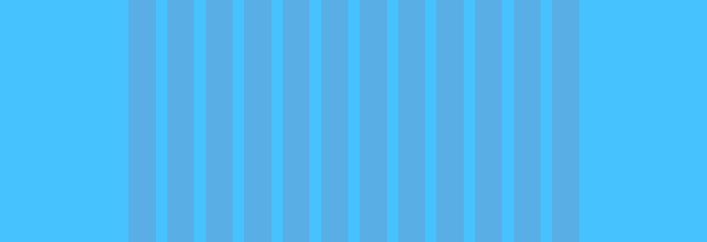

*Container* tidak digunakan saat men-desain, karena sudah diwakilkan dengan *Grid Layout* pada *frame* utama landing page.

#### b. Row  
*Row* adalah tempat atau wadah untuk menempatkan *columns*. Sejatinya lebar *Row* adalah `100%`, sehingga lebarnya akan mengikuti lebar *container* yang membungkusnya.

#### c. Column(s)  
*Column* adalah tempat untuk mengorganisir konten atau elemen website agar sesuai dengan lebar *column* yang terdapat pada *grid system*.

#### d. Section
Salah satu kemudahan dalam men-desain halaman website adalah kita dapat membagi sebuah desain dengan blok atau section. Kita dapat memulai desain dari section satu ke section lainnya.

*Section* akan mewadahi sebuah *container*, yang artinya memiliki lebar sama dengan lebar *screen*. Seperti yang telah disebutkan diatas, *container* berfungsi membatasi konten agar tidak mengikuti lebar *screen* atau *section*.

## B. Membuat landing page

Melanjutkan praktik latihan pada pertemuan pertama, kita akan melengkapi bagian-bagian landing page secara utuh.

Berikut adalah desain landing page yang akan kita buat:

### 1). Download bahan desain

!> Download bahan desain-nya disini:  
https://drive.google.com/drive/folders/1DXDULcAueUk4zj8Z6rUvJAkSVKd3RW0f

### 2). Memaksimalkan fitur Figma

#### a. Spacing shortcut

Spacing yang konsisten adalah salah satu kunci sinergi antara desainer dan programmer web. Dengan aturan spacing yang sudah kita jabarkan diatas, kita dapat membuat spacing yang akurat dengan cara yang mudah dan cepat.

- Mengatur jarak vertikal antar elemen:

	Mengatur spacing di panel properties:

	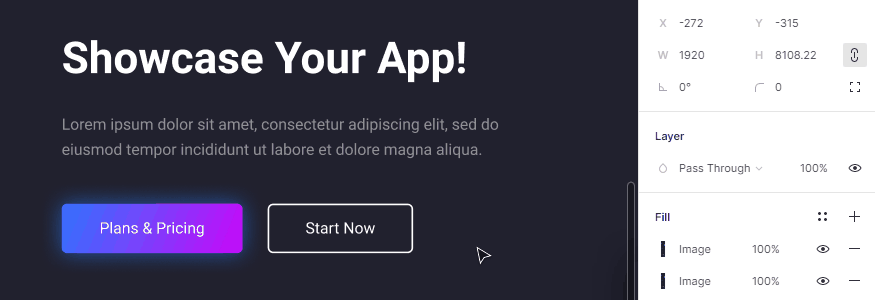
	
	Mengatur spacing dengan drag diantara objek, tekan `Shift` untuk *resize* dengan kelipatan 10px

	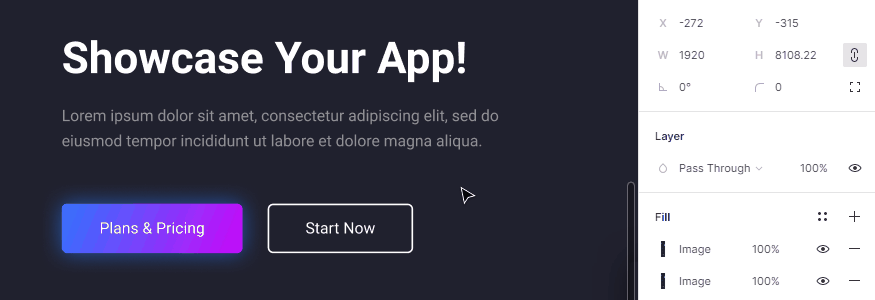

- Mengatur jarak vertikal antar elemen didalam group/frame:
	
	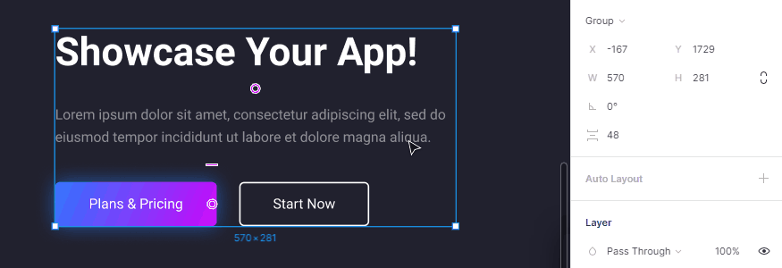

- Fitur ini juga berlaku untuk jarak horizontal
	
	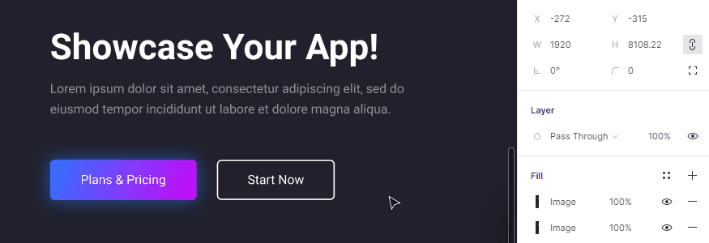

#### b. Component

*Component* digunakan untuk membuat elemen-elemen yang berulang. Dengan *component* kita hanya perlu membuat satu elemen master, yang kemudian dapat kita ubah properti dan kontennya.

Untuk membuat *component* pada Figma, dengan cara men-seleksi objek kemudian pilih menu *Create Component* yang ada dibagian tengah atas atau tekan `Ctrl + Alt + K` pada keyboard:

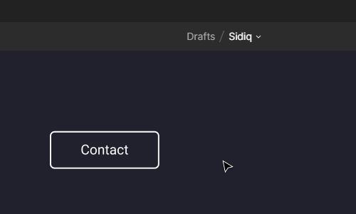

Tampilan layer akan berubah menjadi tanda  seperti pada gambar dibawah ini:

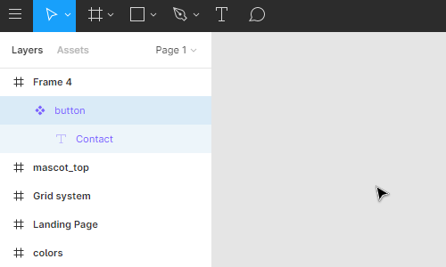

Selanjutnya kita dapat membuat *instance* dari *component* button tersebut dengan cara meng-copy-paste atau men-dupplicate-nya (`Ctrl + D`).

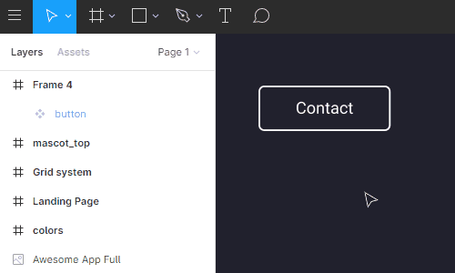

Layer *instance* ditandai dengan warna ungu, namun dengan icon layer yang berbeda sesuai dengan tipe layernya.

Dengan button *instance* ini kita dapat mengubah properti nya seperti fill, stroke dan teks-nya. Jika kita ingin mengubah bentuk misalnya dari rounded menjadi square atau mengubah font-size teksnya menjadi lebih besar, kita dapat mengubah button *component*, kemudian semua button *instance* akan mengikuti perubahan bentuknya.

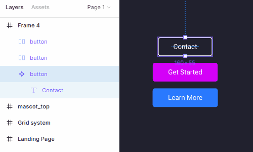

Dari contoh landing page yang akan kita buat, berikut adalah beberapa elemen yang dapat dijadikan *component* karena digunakan berulang:

- Button

	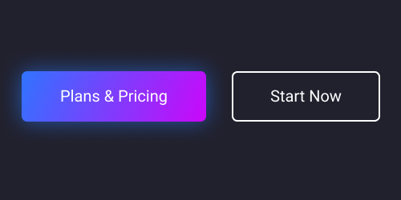

- Content

	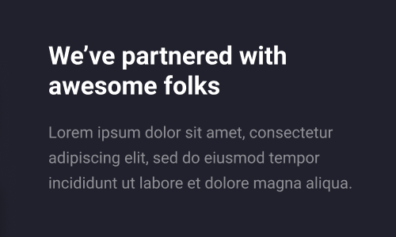

- Feature content

	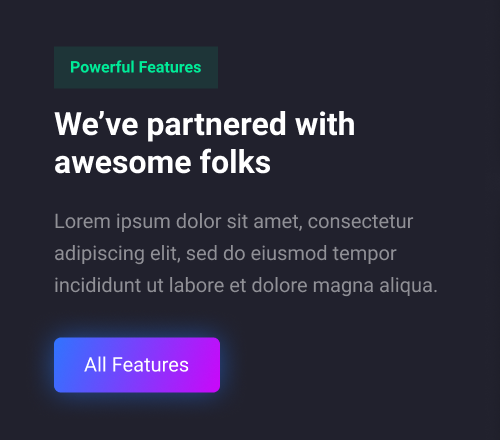

- Feature card

	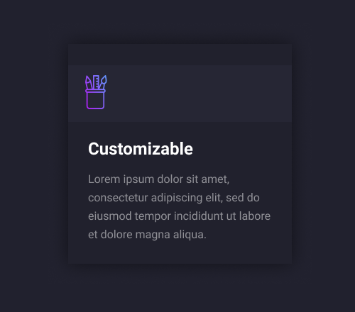

- Faq accordion

	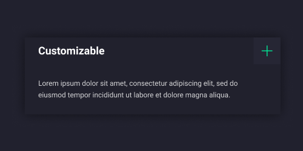

#### c. Auto Layout

*Auto Layout* memungkinkan ukuran *Frame* atau *Group* mengikuti item yang ada didalamnya.

Ada 3 pengaturan inti yang terdapat pada *Auto layout*:

- Horizontal padding (Jarak kanan dan kiri)
- Vertical padding (Jarak atas dan bawah)
- Spacing between items (Jarak antar item didalam layout)

Kemudian ada 2 opsi untuk menempatkan item:

- Vertical (Bertumpuk atas-bawah)
- Horizontal (Berdampingan kanan-kiri)

Kita juga dapat menentukan bentuk tinggi (untuk vertikal) atau lebar (horizontal):

- Auto height / width (Dinamis, mengikuti tinggi atau lebar item)
- Fixed height / width (Statis, item akan terpotong jika kurang dari ukuran fixed nya)

Contoh penggunaan *Auto Layout* pada elemen *button*:

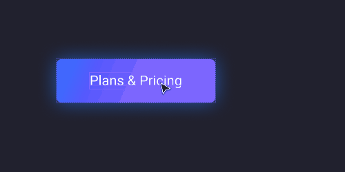

!> **Hanya** objek *Frame* atau *Group* yang dapat di set menjadi *Auto Layout*.
Jika kita menggunakan *Auto Layout*, kita tidak dapat menggunakan *Grid Layout*.

#### d. Frame & Group

Kita dapat membungkus sebuah objek dengan *Frame* atau *Group*, dengan cara `Ctrl + Alt + G` untuk *Frame*, dan `Ctrl + G` untuk *Group*.

?> **Apa perbedaan *Frame* dan *Group* ?**    
*Frame* dapat berfungsi seperti canvas, yang dapat diatur grid dan *Clip content* (Memotong area objek yang keluar dari area *frame*). Sementara *Group* hanya berfungsi untuk mengelompokkan layer agar mudah di organisir.

Baik *Frame* maupun *Group* dapat di set menjadi *Auto Layout*.

#### e. Layer management

Desain website mengharuskan kita untuk meng-organisir layer dengan baik. Karena desain yang dibuat akan di implementasikan kedalam bentuk HTML yang mengharuskan kita mengerti dengan baik setiap elemen yang ada pada desain.

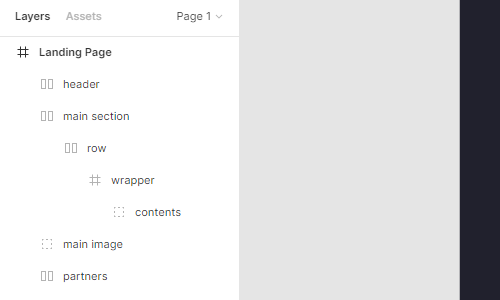

*Layer management* yang dimaksud adalah:

- Memberi nama layer dengan nama yang sesuai kegunaannya
- Group/Frame layer sesuai dengan konteksnya
- Mengurutkan layer dari atas ke bawah

### 3). Komposisi layer pada Figma

Untuk memudahkan saat development ke HTML nantinya, kita gunakan komposisi layout pada [Bootstrap](day2?id=_4-komposisi-layout) yang telah kita jelaskan diatas, dengan sedikit penyesuaian sebagai berikut:

- **Frame utama**  
Berfungsi sebagai wadah semua desain landing page. Kita tinggal gunakan *frame* landing page bagian pertama yang telah kita buat sebelumnya.
- **Frame Section**  
Mengelompokan konten sesuai dengan sectionnya. Karena kita sudah membuat section pertama, maka kita dapat melanjutkan pada section berikutnya. Artinya *frame section* akan berjumlah lebih dari satu. 
- **Frame Row**  
Berfungsi sebagai tempat *column* sebelum menempatkan konten desain.  
- **Frame atau Group Content**  
Berfungsi membungkus konten desain. Kita dapat menggunakan tipe *Frame* atau *Group*.

?> **Tips:**  
Agar memudahkan proses desain seluruh landing page, kita akan memasukkan mascot setelah kita selesai membuat semua layout. Artinya kita fokus pada layoutnya terlebih dahulu.

Berikut adalah contoh bagaimana implementasi dari komposisi layer diatas:

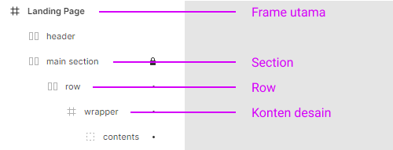

### 4). Section dengan *Auto Layout*

Fungsi *Auto Layout* pada section adalah:

- Memudahkan untuk mengatur *vertical spacing* dengan konsisten
- Memudahkan proses perubahan desain dari versi desktop ke versi mobile
- Membuat tata letak elemen lebih sederhana

!> **Perhatian:**  
Cara ini digunakan untuk memudahkan kita saat membuat desain versi mobile

Ada 2 bentuk frame yang akan kita set menjadi *Auto Layout*:

1. **Section**  
Dengan pengaturan:
	- Layout type: `Vertical`, karena item didalamnya hanya ada *Row* yang akan dibuat bertumpuk dari atas ke bawah.
	- Horizontal padding: `375px`, diambil dari `(1920px - 1170px) / 2` ((Screen width - Container) / 2).
	- Vertical padding: `160px`, artinya ada margin `160px` antara konten desain dengan section.
	- Space between items (vertical): `0px`, dapat disesuaikan kemudian.

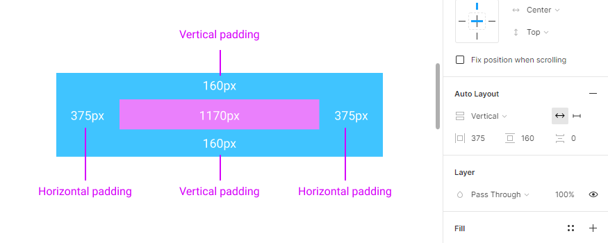

2. **Row**  
Dengan pengaturan:
	- Layout type: `Horizontal`, karena item didalamnya akan berjejer kiri-kanan.
	- Auto height. Supaya tinggi row mengikuti tinggi konten desain yang ada didalamnya.
	- Horizontal padding: `0`, panjang *row* adalah 100% panjang *container*, maka kita tidak perlu horizontal padding.
	- Vertical padding: `0`, 
	- Space between items (horizontal): `30px`, agar item yang ada didalamnya berjarak 30px.

### 5). Cara menggunakan Section dengan *Auto Layout*

Sebelum menggunakannya, kita perlu men-desain konten di frame section tersendiri. Seperti gambar dibawah ini, adalah section untuk *Feature*:

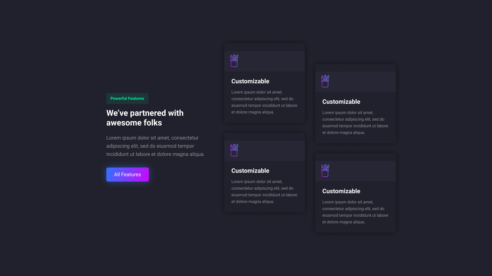

Kemudian copy frame grid system yang ada dibawah ini kedalam file editor masing-masing:

<iframe style="border: none;" width="800" height="450" src="https://www.figma.com/embed?embed_host=share&url=https%3A%2F%2Fwww.figma.com%2Ffile%2Frl3bi6AcgV0MfKVgKHVJIk%2FSidiq%3Fnode-id%3D92%253A81" allowfullscreen></iframe>

?> **Info:**  
Column width hanya sebagai acuan agar lebar konten desain dapat kita sesuaikan dengan lebar kolom, karena kita tidak dapat menggunakan *Grid layout* pada *Auto Layout*.

Selanjutnya ikuti langkah-langkah berikut:

1. **Copy helper section** (`Ctrl + C`) yang sudah disiapkan kedalam frame utama untuk landing page:

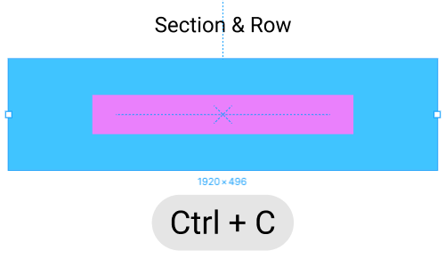

2. **Paste helper section** (`Ctrl + V`) ke frame utama:

3. **Copy** desain konten kedalam layer *Row*:

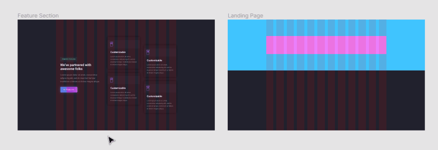

4. Kita akan mendapatkan *Unwanted space* pada section:

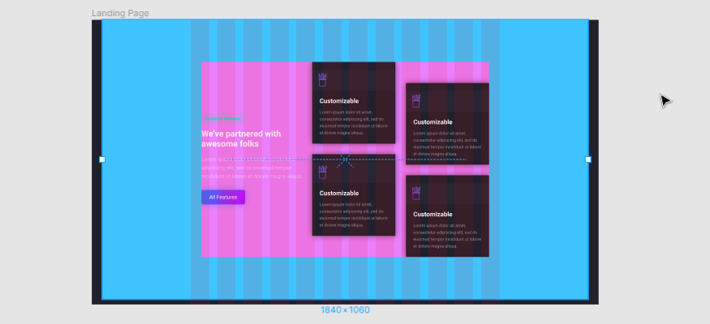

Lebar section tidak lagi 100%, hal ini dikarenakan lebar konten tidak selebar *column*:

Kita dapatkan lebar konten adalah `390px`. Karena pada kondisi tertentu kita membutuhkan space tambahan selain dari *gutter*, supaya layout konten tidak terlalu mepet dengan konten lainnya. 

Dalam kondisi ini, saya ingin menggunakan lebar `5 columns`, namun dengan jarak tambahan `40px` pada sisi kanan dan kirinya.

Cara mendapatkan angka `390px` adalah dengan mengetahui ukuran lebar `5 Columns`. Lebar `5 Columns` ini dapat kita lihat pada frame **Grid System** yang telah di sediakan:

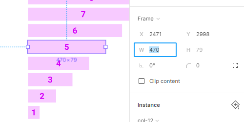

Kita dapatkan ukuran lebar 5 buah kolom adalah `470px`. Karena kita ingin mendapatkan jarak tambahan `40px` kanan dan kiri, maka kita hitung dengan: `470px - (2 x 40px)` (Lebar kolom - (2 x Jarak)) = `390px`.

Agar konten ini dapat sesuai dengan lebar kolom, pertama kita bungkus kontennya dengan *Frame*, dengan cara tekan `Ctrl + Alt + G`. Sampai icon layer berubah menjadi *Frame*. Ubah namanya sesuai konteks, misalnya "wrapper".

Agar spacing-nya sistematis, kita set *Frame* wrapper tersebut dengan *Auto Layout*. Kemudian atur layoutnya menjadi:

- Layout type: `Horizontal`.
- Auto height.
- Horizontal padding: `40px`, nilai jarak tambahan kanan dan kiri yang sudah kita hitung sebelumnya.
- Vertical padding: `0`, 
- Space between items (horizontal): `0`, atau dapat disesuaikan nanti.

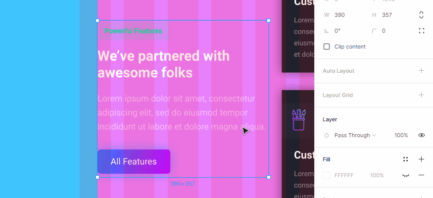

5. Terakhir, kita hide *fill* pada section dan row:

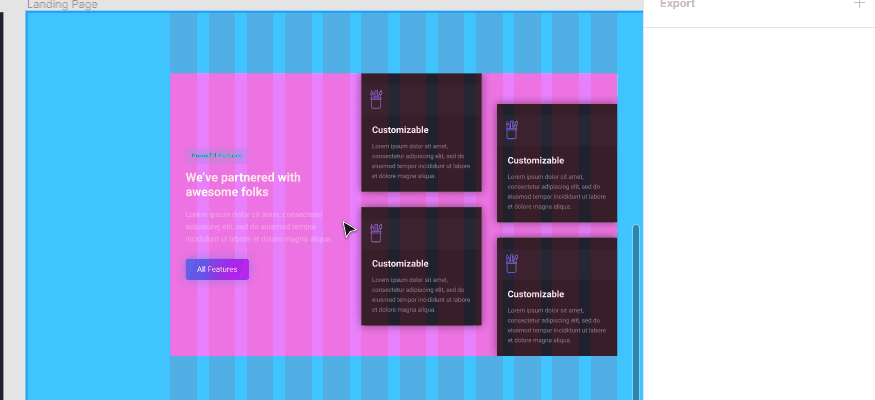

#### 6). Preview hasil akhir

Untuk lebih jelasnya, teman-teman dapat melihat langsung pada file Figma dengan nama "Sidiq" seperti ditampilkan di bawah ini:

<iframe style="border: none;" width="800" height="450" src="https://www.figma.com/embed?embed_host=share&url=https%3A%2F%2Fwww.figma.com%2Ffile%2Frl3bi6AcgV0MfKVgKHVJIk%2FSidiq%3Fnode-id%3D92%253A14" allowfullscreen></iframe>

## C. Pesan untuk Desainer dan Developer

Untuk perusahaan atau startup yang mengembangkan produk tertentu, seorang desainer perlu mempersiapkan *Design identity* atau *UI Kit* untuk setiap elemen yang ada pada aplikasi produknya.

*Design Identity* atau *UI Kit* ini akan berperan penting ketika fase penambahan atau perubahan fitur pada aplikasi. Seorang desainer tidak perlu membuat desain tambahan, karena developer tinggal menggunakan *Design Identity* atau *UI Kit* yang telah disediakan sebelumnya.

Peran seorang developer yang dapat memahami bagaimana menggunakan *UI Kit* dengan tepat akan sangat bermanfaat untuk kecepatan produksi sebuah fitur baru.

!> **Designer** menyiapkan *Design Identity* atau *UI Kit* dan **Developer** memahaminya.

Contoh satu bagian UI Kit dari Gojek.

Sumber: [asphalt.gojek.io](https://asphalt.gojek.io/)